# a LanDen Labs - UiDemo
Android UI Demo

Demonstrate various Ui Components (useful to see how they change on different API levels 19...23)

#Table of Contents
1. [Switches] (#switches)
2. [Checkboxes right side] (#checkboxes-right)
3. [Lists] (#lists)
4. [List animation] (#list-animation)
5. [Text] (#text)
6. [Text Size] (#text-size)
7. [Image Scale] (#imagescale)
8. [Animated Background] (#anim-bg)
9. [Blur Image] (#blur)
10. [Elevation Shadow] (#elev-shadow)
11. [Text Shadow] (#text-shadow)
12. [Line Graph] (#line-graph)
13. [List Animation with Scrolling bar] (#list-anim)
14. [OpenGL Cube rotating] (#opengl)
15. [Relative Layout] (#rellayout)

more

***

[Wiki link](http://landenlabs.com/android/uicomponents/uicomponents.html) for more information.

---

**Ui Demo Menu** 

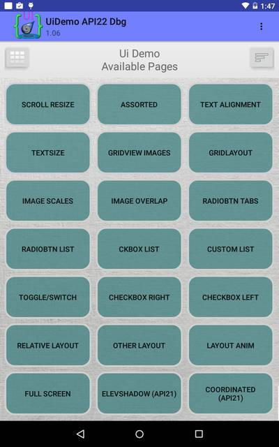
[To Top](#table)
---

**Switches** 

[To Top](#table)
---

**Checkboxes right side**
 

[To Top](#table)
---

**Lists**

[To Top](#table)
---

Press state list animation elevation change 

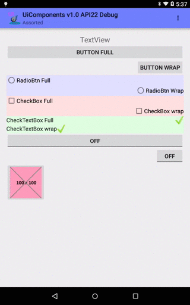

[To Top](#table)
---

**Text**

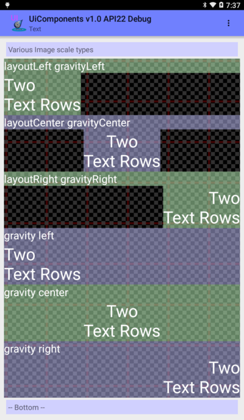

[To Top](#table)
---

**Text Size** 

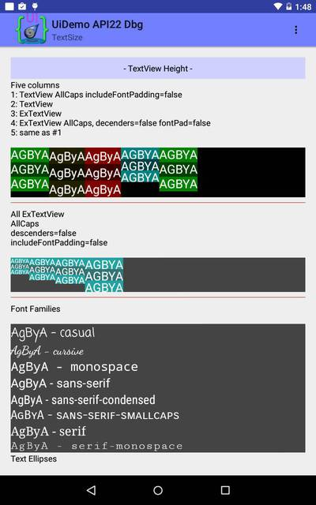

[To Top](#table)
---

**Image ScaleType** 

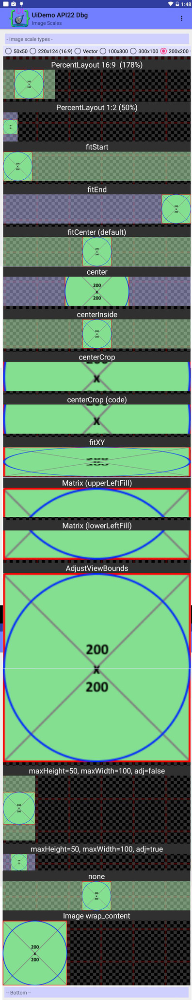

[To Top](#table)
---

**Animaged Background Image** 

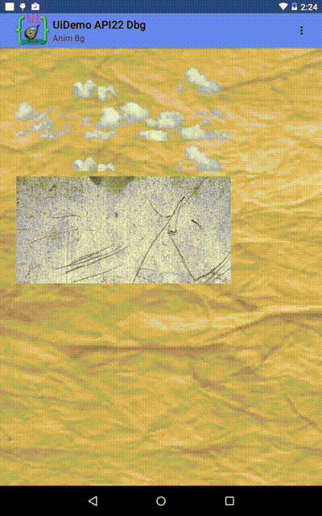

[To Top](#table)

---

**Blur Image** 

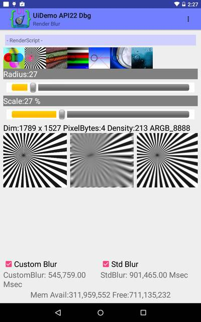

[To Top](#table)
---

**Elevation Shadows** 

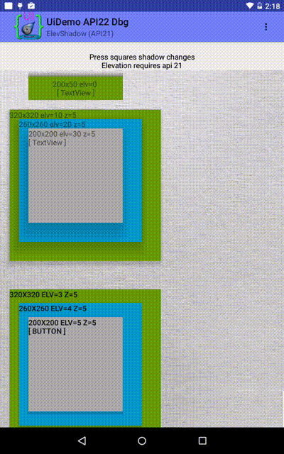

[To Top](#table)
---

**Text Shadow** 

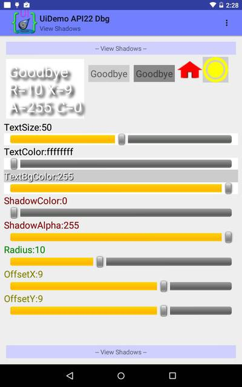

[To Top](#table)
---

**Line Graph** 

[To Top](#table)
---

**List Animation with scrolling bar** 

             
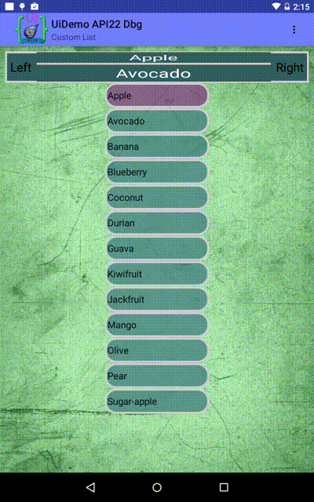

[To Top](#table)

---

**OpenGL spinning cube** 

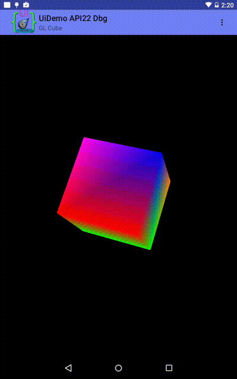

[To Top](#table)
---

**Relative Layout** 

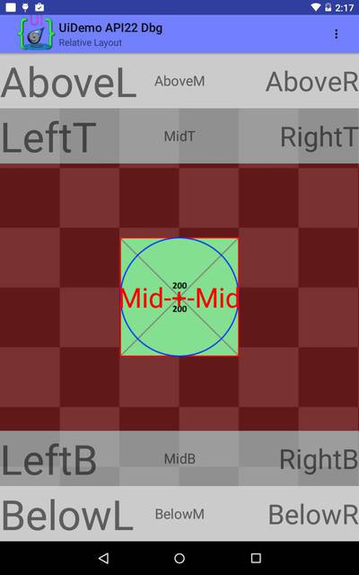

[To Top](#table)
